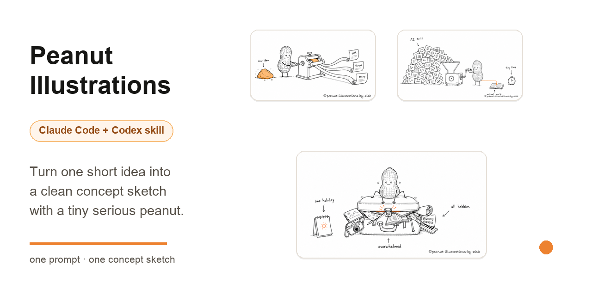
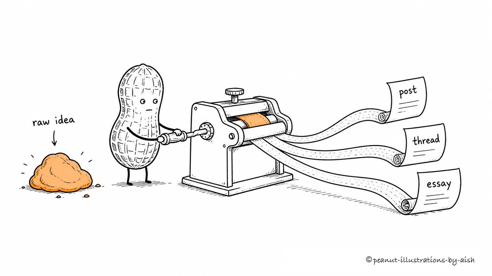
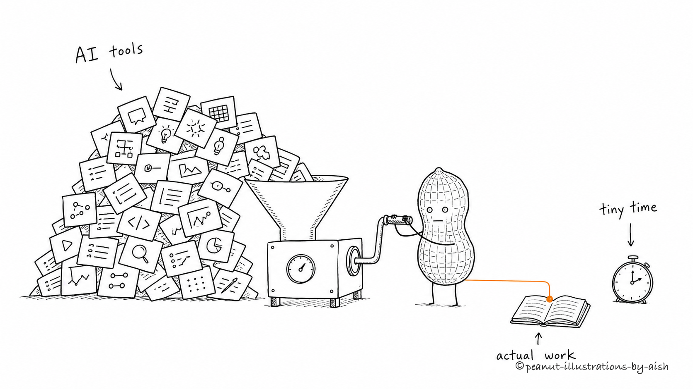
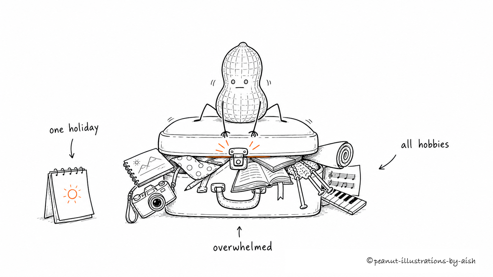
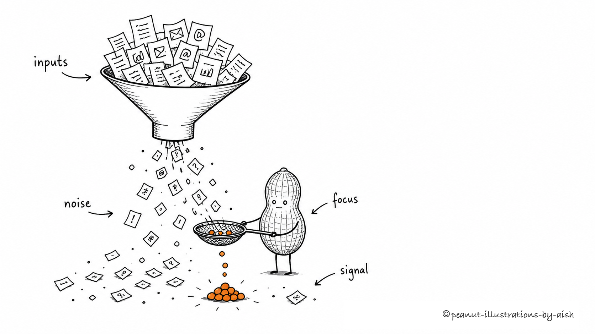
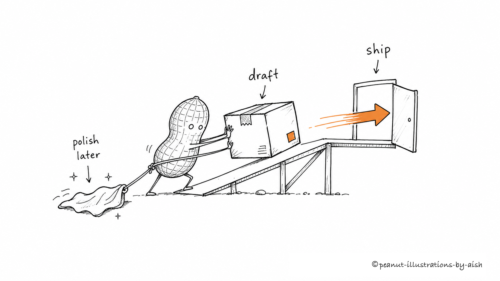
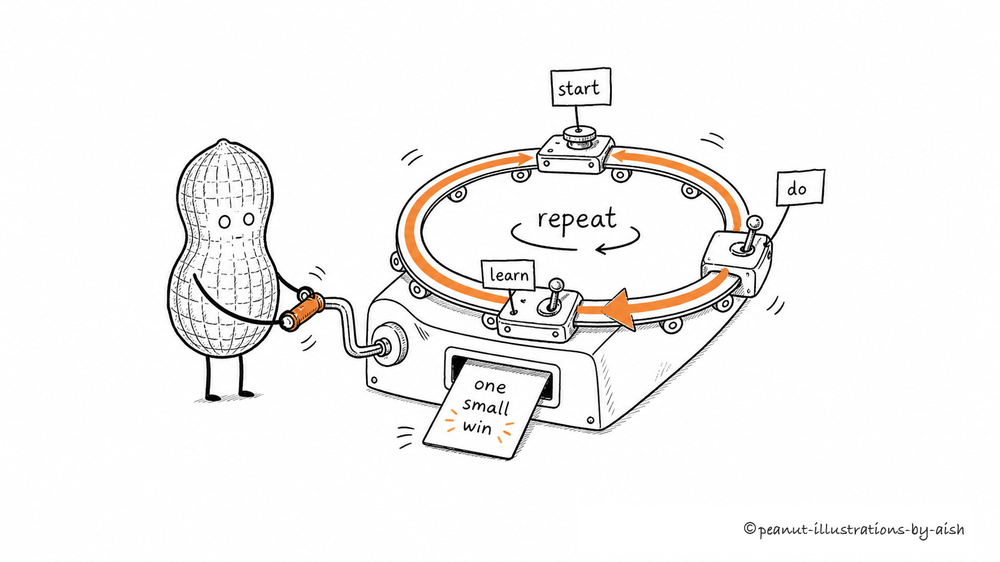
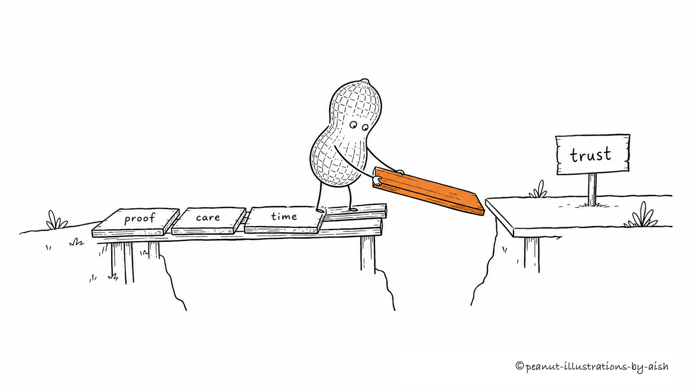

# Cat-Octopus Illustrations



> Turn one short idea into a clean concept sketch with a calm, capable Cat-Octopus.

[](LICENSE)
[](#install)
[](#install)
[](https://github.com/laterstars/cat-octopus-illustrations/stargazers)

**Cat-Octopus Illustrations** is an AI-agent skill for making white-background concept sketches with a recurring Cat-Octopus character. Give it one idea in a sentence. It invents a metaphor, puts the Cat-Octopus to work inside it, and generates one memorable 16:9 image.

The Cat-Octopus is a black cat–octopus hybrid with a rounded cat head, pointed ears, whiskers, a pale face, large vertical eyes, a curled tail, and several short working tentacles. Calm and quietly confident, it behaves like a capable system operator performing an essential but mildly ridiculous task.

**Built by Aishwarya Ashok** — [X](https://x.com/aishashok14) · [LinkedIn](https://www.linkedin.com/in/aishwarya-ashok/)

```text
Use $cat-octopus-illustrations to draw a concept illustration for:
"too many tools, not enough focus"
```

## Gallery

These are example outputs from the skill. Each starts with one short prompt and becomes one composed scene in which the Cat-Octopus performs the core action.

### One idea, three formats

> *"Turn one raw idea into a post, a thread, and an essay."*



### Too many AI tools, too little time

> *"Too many AI tools and too little time to do the actual work."*



### One holiday, all the hobbies

> *"Trying to cram every hobby into one short holiday."*



### Information overload

> *"Information overload."*



### Shipping beats polishing

> *"Shipping beats polishing."*



### A small loop you can repeat

> *"A small loop you can repeat."*



### Building trust slowly

> *"Building trust slowly."*



More copy-pasteable prompts live in [examples/prompts.md](examples/prompts.md).

## Install

Clone the repository:

```bash
git clone https://github.com/laterstars/cat-octopus-illustrations.git
cd cat-octopus-illustrations
```

### Claude Code

```bash
mkdir -p "$HOME/.claude/skills"
cp -R ./cat-octopus-illustrations "$HOME/.claude/skills/"
```

Then invoke it:

```text
Use $cat-octopus-illustrations to draw a concept illustration for:
"shipping beats polishing"
```

### OpenAI Codex

```bash
mkdir -p "${CODEX_HOME:-$HOME/.codex}/skills"
cp -R ./cat-octopus-illustrations "${CODEX_HOME:-$HOME/.codex}/skills/"
```

Then invoke it:

```text
Use $cat-octopus-illustrations to draw a concept illustration for:
"trust is built one piece of evidence at a time"
```

## What makes it different

- **One idea per image.** No dense infographics, dashboards, or PPT-style flowcharts.
- **The Cat-Octopus must do the work.** It is not a mascot pasted into a corner.
- **Its tentacles are functional.** They handle, sort, connect, carry, repair, assemble, guide, or operate the central elements.
- **Clean visual DNA.** Pure white background, black hand-drawn lines, generous whitespace, and one warm-orange accent.
- **Compose first, draw second.** Before generating, the skill states the metaphor, labels, Cat-Octopus action, and layout.
- **Watermark handled locally.** Final images use the exact `© cat-octopus-illustrations-by-aish` watermark instead of asking the image model to spell it.

## How to use

### Draw one idea

```text
Use $cat-octopus-illustrations to draw a concept illustration for this idea:

Trust isn't announced—it's laid down one piece of evidence at a time.

Keep it strange but clean, and make the Cat-Octopus perform the core action.
```

### Draw several ideas at once

```text
Use $cat-octopus-illustrations to draw one image for each of these ideas:
- information overload
- shipping beats polishing
- a small loop you can repeat

Create one composed image per idea, not a collage.
```

### Edit an image

```text
Use $cat-octopus-illustrations to edit this image:
remove the "Workflow" title in the top-left corner and keep everything else the same.
```

## What it produces

By default:

- one 16:9 horizontal concept illustration per prompt
- a short composition note before each image
- a final PNG saved to `assets/<prompt-slug>-illustrations/`

Not produced by default:

- PPTX, PDF, or Keynote files
- SVG, HTML, or Canvas-editable graphics
- commercial posters or key cover visuals
- text-heavy infographics

## How it works

The skill follows this process:

1. Read the short prompt and identify the idea type: judgment, process, contrast, state, or metaphor.
2. Compose the scene: metaphor, Cat-Octopus action, 2–3 labels, and layout.
3. Generate one image with the image model.
4. Check the image against the QA list: clean background, generous whitespace, essential Cat-Octopus action, functional tentacles, one accent color, readable labels, and no PPT-like styling.
5. Add the final watermark locally and save the PNG.

One prompt produces one composed image. The skill makes variations only when the user asks for them.

## Repository structure

```text
.
├── README.md
├── LICENSE
├── NOTICE.md
├── assets/
│   └── social-preview.png
├── examples/
│   ├── images/
│   └── prompts.md
└── cat-octopus-illustrations/
    ├── SKILL.md
    ├── agents/
    │   └── openai.yaml
    ├── references/
    └── scripts/
```

The installable agent skill is the `cat-octopus-illustrations/` subdirectory. The root README, examples, license, and notice are GitHub-facing documents.

## GitHub social preview

Use [assets/social-preview.png](assets/social-preview.png) as the repository’s social preview image:

```text
GitHub repository → Settings → Social preview → Upload image
```

GitHub requires a manual upload here; repository files alone do not set the preview card.

## Notes

- Short labels are more reliable. Keep on-image text to a few brief words.
- One image equals one core structure. Do not turn a prompt into a manual.
- The Cat-Octopus must perform the central action; its tentacles should have meaningful jobs.
- If removing the Cat-Octopus leaves the image fully intact, the character is too decorative.
- Do not make the Cat-Octopus excessively cute, theatrical, or mascot-like.
- AI image models can produce typos, hallucinated labels, style drift, or unwanted titles. Check every result before sharing.
- If text is garbled, reduce the number of labels and regenerate.

## Inspiration and credits

This project is **adapted and translated from** [ian-xiaohei-illustrations](https://github.com/helloianneo/ian-xiaohei-illustrations) by Ian ([@ianneo_ai](https://x.com/ianneo_ai)), an MIT-licensed skill for hand-drawn Chinese article illustrations built around the “小黑 (Xiaohei)” character.

Portions are adapted and translated from the original. Cat-Octopus Illustrations changes the character to a calm cat–octopus system operator, reduces the palette to one warm-orange accent, switches the output language to English, and uses a short-prompt, single-image input model. No artwork from the original is redistributed; all images are generated independently. See [NOTICE.md](NOTICE.md) for the retained upstream copyright notice.

## License

MIT License. See [LICENSE](LICENSE).
